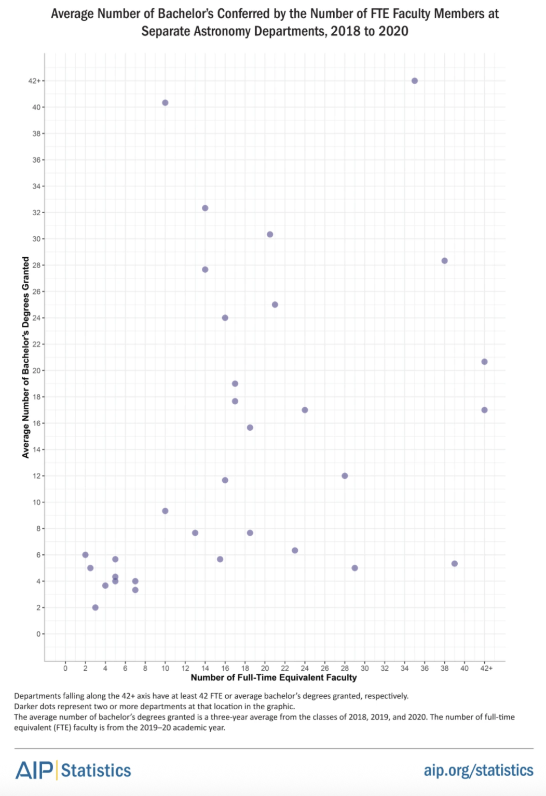

:show_git_badge: true

.. _advising_students:

=================
Advising Undergrads
=================

.. admonition:: Needs Further Input

   This page would benefit from input from grads who have previously advised undergrads at Berkeley. If this applies to you, please see :ref:`contributing` to add your experience and/or expect to hear from Ben in the near future!

Challenges Facing UC Berkeley Undergrads
----------------------------------------

UC Berkeley has an unusually imbalanced astronomy student-to-faculty ratio: 
as of Spring 2026, there are a few hundred declared Astrophysics majors (i.e., sophomores, juniors, and seniors)
and 13 senate faculty. The following figure from 
`a 2022 study by the American Institute of Physics <https://www.aip.org/statistics/size-of-undergraduate-physics-and-astronomy-programs>`_
shows the distribution of "Astronomy Departments" (that is, separate from physics)
at US schools over graduating class size and number of full-time faculty. 
The AIP does not publish which marker on this plot corresponds to which department, but the upper-leftmost outlier
is consistent with Berkeley's Astrophysics class and Astronomy faculty sizes in 2020 (and the imbalance has worsened since then).

As you might expect, this makes it extremely difficult for undergrads at Berkeley 
to find research opportunities, especially in their first two years. 
In an increasingly selective grad admissions environment,
there is also substantial pressure on any undergrads pursuing grad school to find such opportunities *somehow*.

For an astronomy grad at Berkeley, there is no requirement to mentor undergrads on research projects or in any other way.
However, if you do choose to take on mentees, you make an enormous difference in their lives. 

This page lists opportunities for mentorship and 
gives accounts by grad students who have previously mentored undergrads of their experiences. 
The list is not exhaustive and other pathways may be possible, but grads are encouraged to mentor undergrads through 
tried-and-true university and/or department pathways to maximize benefit to the student through indicators like 
faculty letters of rec.

Advising Opportunities
----------------------

.. admonition:: To Be Expanded: Advising Opportunities

   This section will be expanded with resources for publicizing research opportunities, getting involved with MPS Scholars,
   and supporting undergrads in less intensive ways.

Research Fairs
^^^^^^^^^^^^^^
MPS Scholars
^^^^^^^^^^^^

.. admonition:: To Be Expanded: DeCals

   This section will be expanded with information on DeCals, including Caleb's recent exoplanet RV DeCal 
   `(C. K. Harada et al. 2024) <https://ui.adsabs.harvard.edu/abs/2025AJ....170..343H/abstract>`_.

SPORES-HWO RV Hunters
^^^^^^^^^^^^^^^^^^^^^
   